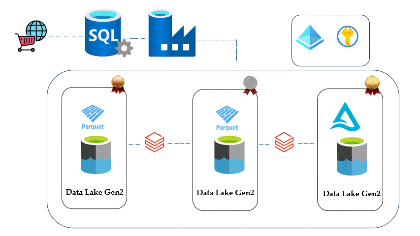

# Azure Data Engineering Project

This project demonstrates the design and implementation of a robust **ETL pipeline** and **data transformation** workflow using **Azure** and **Databricks**. It involves the creation of various resources in **Azure** to build an efficient, automated data processing system for large-scale datasets.

## Project Overview

This project utilizes multiple Azure services, including **Azure Data Factory**, **Azure Databricks**, **Azure SQL**, and **Azure Data Lake**, to manage and transform data. It follows the **Medallion Architecture** and aims to provide a dynamic, real-time ETL pipeline to efficiently process data from various sources.

### Architecture Overview

The architecture for this project follows a structured data flow using the **Medallion Architecture** model. The system supports:
- **Data Ingestion** using Azure Data Factory
- **Data Transformation** with PySpark in Azure Databricks
- **Data Storage** in Azure Data Lake and Azure SQL
- **Real-time Data Processing** using ETL pipelines in Azure Data Factory



*Above is the architecture diagram showcasing the flow and interactions between components.*

## Key Features

- **Data Ingestion Pipeline:** Import data from various sources via Azure Data Factory.
- **Data Transformation:** Perform transformations on large datasets using PySpark in Azure Databricks.
- **Dynamic ETL Pipelines:** Automated and dynamic ETL pipelines to manage and process data.
- **Data Modeling:** Implemented **Star Schema** with **Fact Tables** and **Surrogate Keys**.
- **Slowly Changing Dimensions:** Implemented logic to manage slowly changing dimensions in data transformation.

## Setup Instructions

To run this project on your own Azure account, follow these steps:

### 1. **Set Up Azure Resources**
   - Create the necessary Azure resources: **Data Lake**, **SQL Server**, **Data Factory**, and **Databricks**.

### 2. **Clone the Repository**
   Clone this repository to your local machine:
   ```bash
   git clone https://github.com/Hamza88-coder/cars_data_enginneer_project.git
